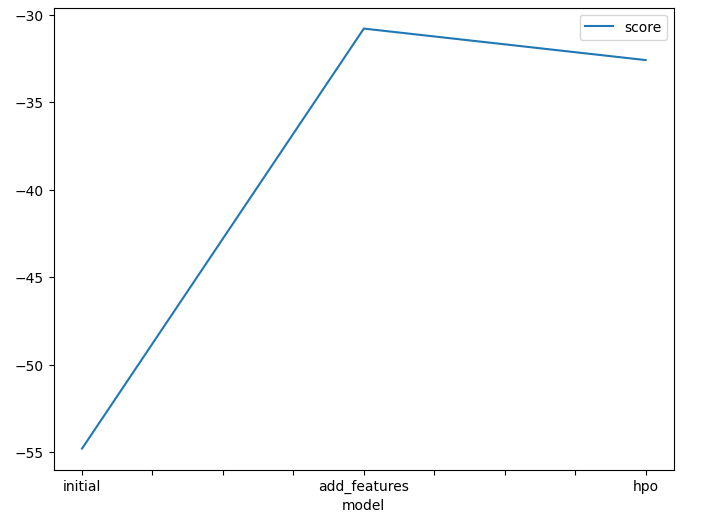
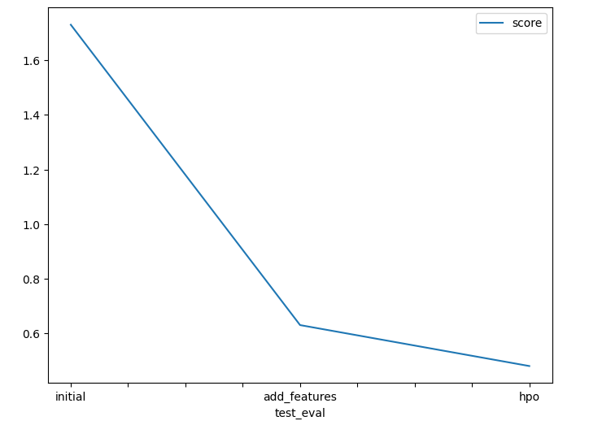

# Report: Predict Bike Sharing Demand with AutoGluon Solution
#### Anilson Monteiro

## Initial Training
### What did you realize when you tried to submit your predictions? What changes were needed to the output of the predictor to submit your results?
- I realized that the output of the predictor was not in the correct format to submit had to check the sumission template to understand the correct format.

### What was the top ranked model that performed?
RandomForestMSE_BAG_L2 with -53 score on AutoGluon

## Exploratory data analysis and feature creation
### What did the exploratory analysis find and how did you add additional features?
Added aditional features by creating a new column for the hour of the day and the day of the week. The exploratory analysis found that the demand for bikes has a seasonal variation over the datetime chart, with high demands and declining on certain periods of the year.

### How much better did your model preform after adding additional features and why do you think that is?
For 'LightGBM_BAG_L2' model from -54.8 to -30.4, this because the new features help the model to understand the seasonality of the demand for bikes, in a granular way.

## Hyper parameter tuning
### How much better did your model preform after trying different hyper parameters?
For 'LightGBM_BAG_L2' model from -30.4 to -32.2, the improvement was not significant, but the model was able to find a better hyperparameter configuration.

### If you were given more time with this dataset, where do you think you would spend more time?
Trying to add more features to the model or to break down inner hidden features, and trying to understand the seasonality of the demand for bikes.

### Create a table with the models you ran, the hyperparameters modified, and the kaggle score.

| model        | LightGBM_BAG_L1 | LightGBM_BAG_L2 | LightGBMXT_BAG_L2 | score |
| ------------ | --------------- | --------------- | ----------------- | ----- |
| initial      | -131.0          | -54.8           | -60.5             | 1.73  |
| add_features | -33.9           | -30.8           | -31.0             | 0.63  |
| hpo          | -33.9           | -32.6           | -33.3             | 0.48  |
### Create a line plot showing the top model score for the three (or more) training runs during the project.

### Create a line plot showing the top kaggle score for the three (or more) prediction submissions during the project.

## Summary
In summary the model was able to improve the prediction score by adding new features and tuning the hyperparameters, the model was able to understand the seasonality of the demand for bikes and predict the demand with a good accuracy, a review of the hyperparameters helped to improve the model even more by doing simple adjustments to parametes like learning rate, evaluation metrics and number of iterations.